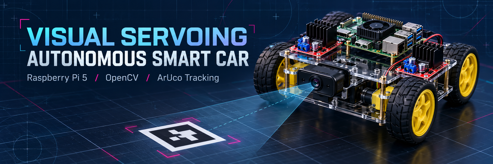

# Visual Servoing Autonomous Smart Car



Raspberry Pi 5 + USB camera + OpenCV ArUco marker following with camera calibration, pose estimation and PWM differential steering on a 4WD chassis.

## Reconstruction status

This is a reconstructed implementation based on the team's [project report](docs/project-report.pdf) and Omar Sadat's hardware clarification. The original source code was lost. The report documents the original car; the replacement software has not yet been tested on that car. No video or original calibration files are included.

**Course:** CSE331, Microprocessor Interfacing, Section 04, Group 03.  
**Instructor:** Md Raqibur Rahman (RQN).  
**Project team:** Md. Mofidul Hassan, Somik Miah, and Omar Sadat.

See [report alignment and implementation notes](docs/REPORT_ALIGNMENT.md) for confirmed details and configurable assumptions.

## Assumed hardware

Two L298N drivers, with one motor per channel and no steering servo. The default mapping assigns driver 1 to the front motors and driver 2 to the rear motors. Both left motors receive the left command; both right motors receive the right command. This mapping is an assumption, not recovered wiring. Check each motor's stall current and each driver's combined thermal/current limits against your module and supply ratings. Example BCM pins are configurable and are not verified against the original wiring.

| Driver / motor | Direction inputs | Pi BCM GPIO | PWM enable GPIO |
| --- | --- | --- | --- |
| 1 / front left | IN1 / IN2 | 17 / 27 | ENA: 12 |
| 1 / front right | IN3 / IN4 | 22 / 23 | ENB: 13 |
| 2 / rear left | IN1 / IN2 | 5 / 6 | ENA: 18 |
| 2 / rear right | IN3 / IN4 | 24 / 25 | ENB: 19 |

Each `pins.left` / `pins.right` entry lists front then rear, with `[forward, backward, enable]` BCM GPIO numbers. Swap a motor's forward/backward pin entries if its direction is reversed. Keep all 12 GPIO assignments distinct. Both drivers and the Pi must share signal ground; do not connect the two modules' regulator outputs together. Remove ENA/ENB jumpers on **both** drivers. PWM is software-generated by gpiozero/lgpio, not four independent hardware-PWM channels.

Remove ENA/ENB jumpers before GPIO PWM. Use separate regulated Pi and motor supplies, with common signal ground. Never feed motor voltage into Pi GPIO or power the Pi from the L298N regulator. Verify your module's logic supply/jumper requirements from its documentation. Add a physical motor-power cutoff. Software watchdogs cannot protect against power loss, process death or a locked operating system. No obstacle avoidance is provided.

## Install on Raspberry Pi OS

Use Python 3.11 or later. Install **one** OpenCV package only, with contrib/ArUco support. The lgpio pin factory supports Pi 5; availability depends on the OS and GPIO permissions.

```bash
python3 -m venv .venv
source .venv/bin/activate
pip install -r requirements.txt
python -m unittest -v
```

If an ARM OpenCV wheel is unavailable, use your OS OpenCV package with ArUco support and a venv with system-site-packages instead of installing conflicting OpenCV distributions.

## Calibrate and run

Take at least 12 (preferably 20+) sharp images of a chessboard across the full camera view, at varied angles and distances. Use a fixed camera focus and resolution. Defaults mean 9 by 6 **inner corners**, with 25 mm squares; measure your printed board.

```bash
python calibrate.py 'photos/*.jpg' --columns 9 --rows 6 --square-m 0.025
python follow.py                 # Preview / dry run, no GPIO outputs
python follow.py --drive         # Enables motors explicitly
python follow.py --headless      # Dry run over SSH, without desktop windows
python follow.py --headless --drive
```

Use marker ID 1, visible in the report's tracking screenshot. This reconstruction uses OpenCV's DICT_4X4_50 dictionary. Set its measured outer black-square width (excluding the white margin) in `marker_size_m`. Put the camera facing forward without mirroring. Start with the wheels raised, confirm each motor direction and left/right mapping, then test at low speed in a clear area with the cutoff within reach. Press q or Ctrl+C to stop.

Generate a printable marker using `python make_marker.py`. The marker dictionary and physical size were not specified in the report; these defaults must match the marker you actually print. Calibration paths are resolved relative to your configuration file.

### Earlier image-centering version

The report describes a simpler version before calibration. Run `python follow.py --mode basic` to preview it without calibration, or append `--headless` for SSH. Add `--drive` only after configuring your wiring. Basic mode steers from horizontal image offset and stops when the average marker edge exceeds `basic_stop_width_fraction` of image width. This is an apparent-size heuristic, not a distance measurement; marker angle and size affect it. The calibrated `pose` mode remains the default.

### Troubleshooting

- GPIO: the code explicitly selects `LGPIOFactory`, matching the report's `GPIOZERO_PIN_FACTORY=lgpio` solution. Check OS GPIO permissions and installed lgpio support.
- SSH: use `--headless`; terminate with Ctrl+C. Keep the Pi powered from its dedicated supply as described in the report.
- Calibration mismatch: use the same resolution, focus and webcam for calibration and operation.
- Weak or unstable movement: check motor supply under load, driver limits and motor direction; the report describes resolving separate motor/Pi power problems.
- Lost target: the controller stops all four channels and resumes after a valid target returns.

## How it works

Calibrated frames → ArUco corners → square-marker solvePnP → range/bearing → proportional speed and differential steering → slew-limited PWM. Invalid/lost markers, excessive loop delay and near targets command an immediate stop. A separate watchdog stops motor commands after 350 ms without an update. The car only drives forward. Target distance defaults to 0.65 m and PWM is capped at 35%. Pose reprojection error must be below 3 pixels.

The controller uses camera-frame lateral displacement and forward depth. It does not use full marker orientation, wheel encoders or an obstacle detector. PWM is a duty cycle, not measured speed. Tune gains, marker size, camera quality and power delivery before physical use.

## Files

- `calibrate.py`: offline camera calibration
- `follow.py`: webcam, detection, pose and following loop
- `control.py`: hardware-independent steering logic
- `vision.py`: validated calibration loading and marker pose estimation
- `make_marker.py`: printable marker generation
- `motors.py`: GPIO and timeout stop
- `config.json`: measured geometry, gains and example wiring
- `test_control.py`: controller regression tests
- `test_motors.py` / `test_vision.py`: routing, marker detection and synthetic pose checks
- `docs/project-report.pdf`: supplied original report

## Demo

Add the surviving demonstration video or a hosted link here when available. Label it as the original hardware demonstration; do not present it as a validation of this reconstructed code.

## References

- [OpenCV ArUco detection and pose tutorial](https://docs.opencv.org/4.x/d5/dae/tutorial_aruco_detection.html)
- [gpiozero Motor API](https://gpiozero.readthedocs.io/en/stable/api_output.html#motor)
